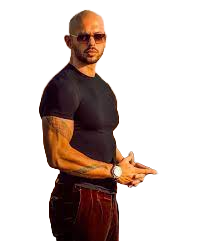

<html>
<head>
  <title>:muscle:TATE</title>
  </head>
<body>
<h1>About TATE</h1>
<h3>INTRODUCTION</h3>

Andrew Tate is a British kickboxer, entrepreneur, and social media personality. He is known for his controversial opinions and unapologetic approach to life. Tate was born in the United States in 1986 but later moved to England where he began his kickboxing career.

Tate has achieved significant success in kickboxing, winning numerous titles including the IKF World Championship and the WAKO World Championship. He retired from professional kickboxing in 2016 to focus on his businesses and social media ventures.

Tate's social media presence has garnered significant attention, with over 500,000 followers on Instagram and a large following on YouTube. He is known for his provocative and controversial opinions on a range of topics, including politics, relationships, and mental health.

Despite the backlash he has faced for his opinions, Tate remains unapologetic and often doubles down on his controversial views. He has been accused of being sexist, racist, and promoting toxic masculinity, but he maintains that he is simply speaking his mind and not conforming to societal norms.

Tate's approach to life and his controversial opinions have earned him both admirers and critics. Some see him as a refreshing voice of honesty in a world of political correctness, while others view him as a dangerous influence promoting harmful ideas.

In conclusion, Andrew Tate is a complex and controversial figure who has achieved significant success in kickboxing and garnered a large following on social media. While some admire his unapologetic approach to life, others criticize his controversial opinions and the potential harm they may cause. Regardless of one's opinion of him, there is no denying that Tate is a unique and polarizing figure in today's society.

<h3>Latest News</h3>

He had his appeal against continued detention in Romania rejected by a court, meaning he will remain in custody until 29 March. [1] Recently, on 5 February 2023, Tate tweeted from his Romanian prison cell that he has updated his will and will donate $100 million[2]. As of now, there are no further updates on his case. To stay up-to-date with the latest news on Andrew Tate, one can visit Marca's website, which provides news, posts, videos, and analysis related to him.

<h3>Theme Song</h3>
<!DOCTYPE html>
<html>
<head>

</head>
<body>

<button1 onclick="window.location.href='https://youtu.be/vtNJMAyeP0s';">
<button class="button button1">Tourner Dans Le Vide</button>
  </body>

  <body>
<h1>Supporting TATE</h1>
<h3>Reasons people support TATE</h3>

Some people may support him because they agree with his views on various topics, such as masculinity, entrepreneurship, and personal responsibility.

Tate has also been vocal about his opposition to political correctness and cancel culture, which some people view as a threat to free speech and individual liberty. Additionally, he has been involved in several charity initiatives, including raising funds for veterans and helping homeless people.

However, it is worth noting that not everyone agrees with Andrew Tate's views, and many people find his statements offensive or inappropriate. It is essential to respect differing opinions and engage in respectful discourse rather than promoting divisive or harmful rhetoric.

Overall, whether or not to support Andrew Tate is a personal decision that depends on one's beliefs and values. It is crucial to approach political and social issues with an open mind, respect for others, and a commitment to constructive dialogue.

<h3>Supporters</h3>

After searching for years I have finall found the biggest supporter and fan of Andrew TATE. His name is Farhan TATE. Here is a clip of him if you wanna check.

<video width="230" height="240" controls>
  <source src="TATE.mp4" type="video/mp4">
Your browser does not support the video tag.
</video>
  </body>
</html>

